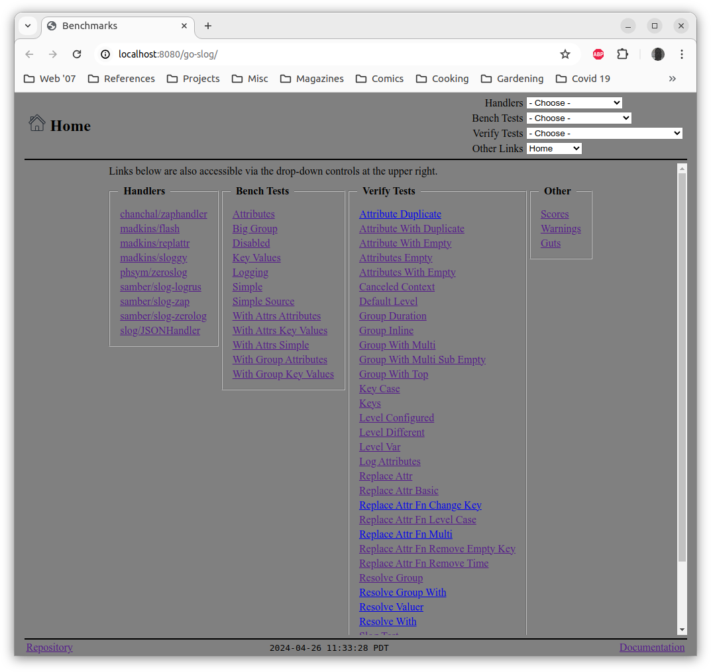
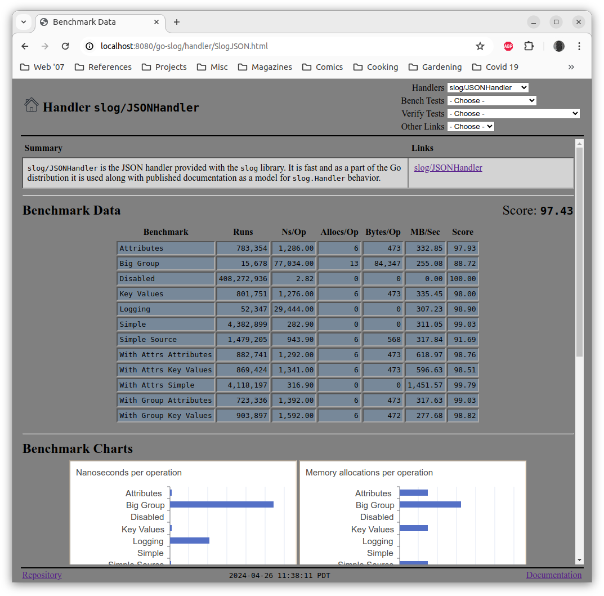
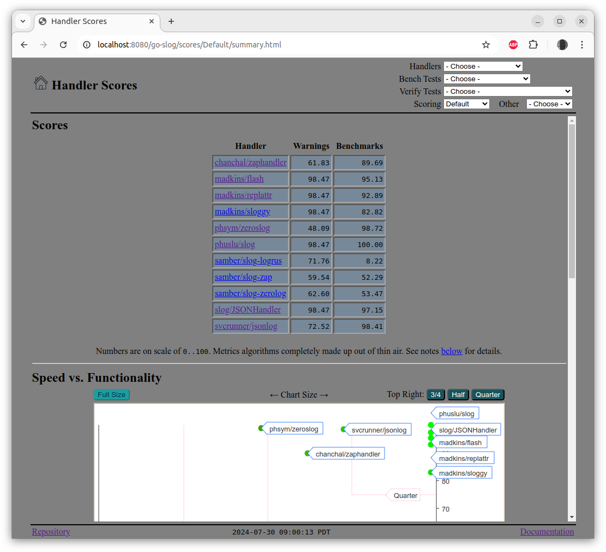
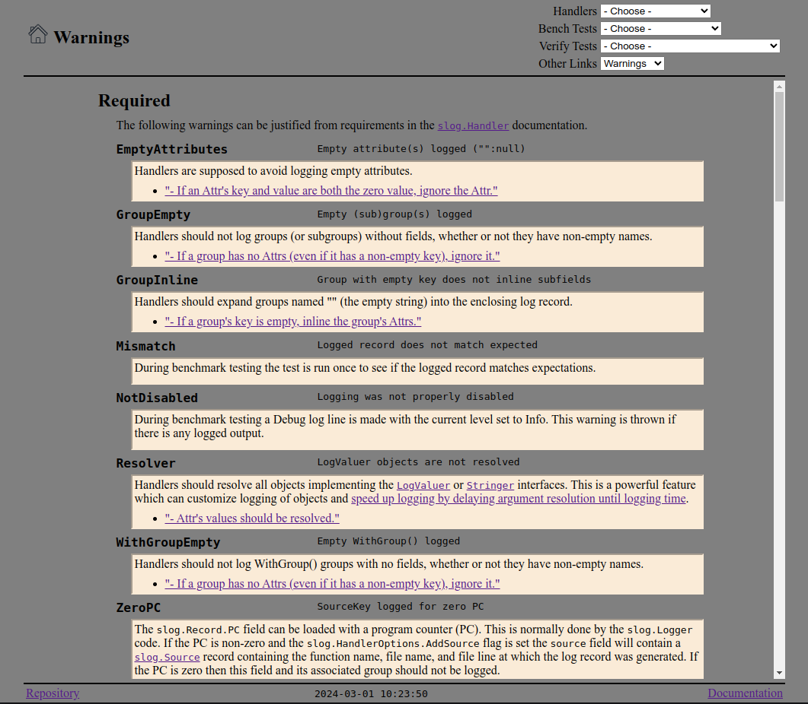

# `server`

The `cmd/server` application displays benchmark and verification results as web pages.

## Server Pages

The home page shows links to various test data pages and the warnings:

Test pages show the same tables as `tabular` plus charts comparing the results:

Handler pages show similar tables plus charts comparing the results:

The scores page shows how different handlers related on a functionality vs. performance chart:

The warning page shows all the defined warnings with descriptions:

## GitHub Pages

Once a week (or whenever code is committed to the `go-slog` repository)
the server is run and all pages are copied to the `docs` directory.
This is committed back into the repository and
[GitHub Pages](https://pages.github.com/) serves the
[recent benchmark data](https://madkins23.github.io/go-slog/index.html).
