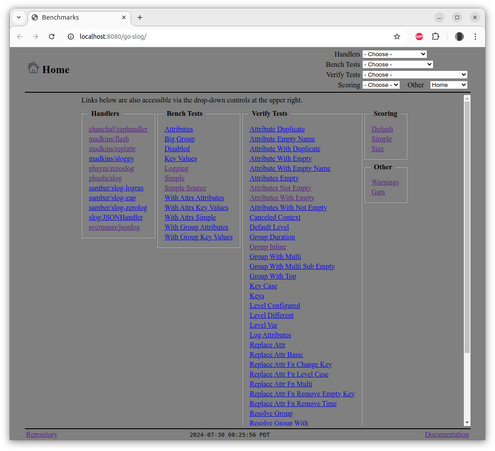
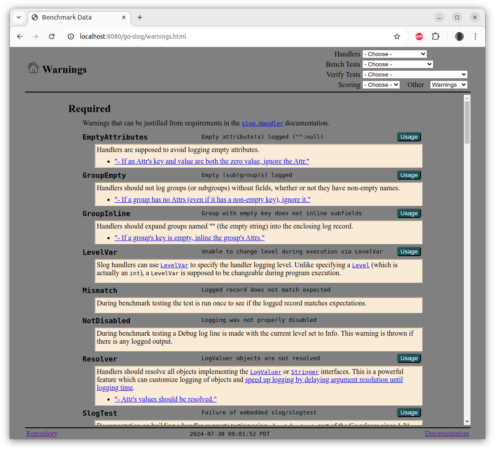

# `server`

The [`server`](../cmd/server/server.go) application consumes the output saved in a temporary directory by
`scripts/bench` and `scripts/verify` and serves various web pages
that provide the output as tables and charts.

## Running `server`

Usage:

	go run cmd/server/server.go [flags]

The flags are:

	-bench string
	    Load benchmark data from path (optional)
	-language value
	    One or more language tags to be tried, defaults to US English.
	-useWarnings
	    Show warning instead of known errors
	-verify string
	    Load verification data from path (optional)

Script:

The `scripts/server` script will run the server,
taking input from temporary files created by `scripts/verify` and `scripts/bench`.

Output:

```
GOROOT=/snap/go/current #gosetup
GOPATH=/home/marc/go #gosetup
/snap/go/current/bin/go build -o /home/marc/.cache/JetBrains/GoLand2023.3/tmp/GoLand/___run_server /home/marc/work/go/src/github.com/madkins23/go-slog/cmd/server/server.go #gosetup
/home/marc/.cache/JetBrains/GoLand2023.3/tmp/GoLand/___run_server -bench=/tmp/go-slog/bench.txt -verify=/tmp/go-slog/verify.txt
12:31:18 WRN Creating an Engine instance with the Logger and Recovery middleware already attached.
12:31:18 WRN Running in "debug" mode. Switch to "release" mode in production.
 - using env:   export GIN_MODE=release
 - using code:  gin.SetMode(gin.ReleaseMode)
12:31:18 INF Web Server @ http://localhost:8080/go-slog
12:31:19 INF HasTest() test=Verify:KeyCase found=true
12:31:19 INF 200 |    5.012399ms |             ::1 | GET      "/go-slog/test/Verify:KeyCase.html"
12:31:19 INF 200 |      46.763µs |             ::1 | GET      "/go-slog/home.svg"
12:31:19 INF 200 |     169.933µs |             ::1 | GET      "/go-slog/style.css"
```

## Server Pages

The home page shows links to various test data pages and the warnings:


Test pages show the same tables as `tabular` plus charts comparing the results:


Handler pages show similar tables plus charts comparing the results:


The warning page shows all the defined warnings with descriptions:


## GitHub Pages

Once a week (or whenever code is committed to the `go-slog` repository)
the server is run and all pages are copied to the `docs` directory.
This is committed back into the repository and
[GitHub Pages](https://pages.github.com/) serves the
[recent benchmark data](https://madkins23.github.io/go-slog/index.html).
