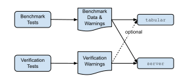
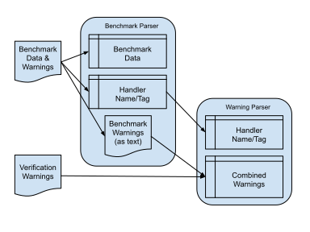

# Parsing Output Data

The `data` package parses output from benchmark and verification testing into data objects.

## Data Flow

The overall data flow between the various major processes in this repository is shown in the following diagram:



The processes on the left are completely disconnected from the ones on the right.
Configuration objects necessary for benchmarks and verification testing are not available
to the commands `tabular` and `server`, they only have text data output from the testing.

Benchmark tests generate two main types of output:

**The first type** is the benchmark data itself, generated by `go test -bench` in lines like the following:
```
BenchmarkSlogJSON/BenchmarkLogging-8   50026   21898 ns/op   20678166.73 MB/s   0 B/op   0 allocs/op
```
There is no way to control the output, so it is necessary to parse the string at the beginning
of the line to get the handler tag (`SlogJSON`) and the test tag (`Bench:Logging`).

**The second type** is the warning data collected during the benchmark testing process:

```
# Warnings for chanchal/zaphandler:
#   Implied
#      1 [SourceKey] Source data not logged when AddSource flag set
#          SimpleSource: no 'source' key
#            {"level":"info","time":"2024-02-25T08:21:51-08:00","msg":"This is a message"}
# 
# Warnings for phsym/zeroslog:
#   Implied
#      1 [SourceKey] Source data not logged when AddSource flag set
#          SimpleSource: no 'source' key
#            {"level":"info","caller":"/home/marc/work/go/src/github.com/madkins23/go-slog/bench/tests/benchmarks.go:71","time":"2024-02-25T08:22:26-08:00","message":"This is a message"}
# 
# Warnings for samber/slog-zap:
#   Implied
#      1 [SourceKey] Source data not logged when AddSource flag set
#          SimpleSource: no 'source' key
#            {"level":"info","time":"2024-02-25T08:23:02-08:00","caller":"tests/benchmarks.go:71","msg":"This is a message"}
```

Verification tests generate only one type of output: verification warnings.
These look like the warnings generated by the benchmark testing (see above)
but there are generally a lot more of them.

## Parser Data

The parsing of output data from benchmark and verification tests is done by
two entities from the `data` package:
* the benchmark parser [`internal/data/Benchmarks.ParseBenchmarkData`](bench_parser.go) and
* the warnings parser [`internal/data/Warnings.ParseWarningData`](warnings_parser.go).

### Handler Names and Tags

Handlers have tags and names:
* tags are restricted in form
    * they are parsed from benchmark test function names and
    * are to be used in web URLs by `server` and
* names are free form and generally of the form `Phsym/zeroslog` or `Slog/JSONHandler`.

The _only_ time when tags and names are both accessible is during benchmark testing.
The test function name can be parsed and the handler name is provided by
the `infra.Creator` object composed into the `SlogBenchmarkSuite` object.
However, this data is required by the `Warnings` parser which is a separate process.

The solution to this problem implemented herein is to declare the relationships
between handler tags and names to be a separate data element.
This third type of data is emitted during the benchmark testing process as a set of lines:
```
# Handler[SlogJSON]="slog/JSONHandler"
```
which link the handler tag (`SlogJSON`) with the handler name (`"slog/JSONHandler"`).
One of these lines is emitted for each defined handler.

## Parser Setup

As shown in the following diagram:



the benchmark parser gathers from the benchmark output:
* benchmark data,
* handler name/tag mapping, and
* benchmark warnings as unprocessed text.

After this the warning parser takes the handler name/tag mapping from the benchmark parser
and parse the benchmark warnings and verification warnings separately,
combining the result together into one warning data block.

The [`data.Setup` function](setup.go) is designed to execute both parsers
with the appropriate order and arguments.
Create one parser of each type and pass them to the `data.Setup` function.
The new parser objects will contain the parsed data unless an `error` is returned.

## Scoring

Scoring data is derived from benchmark and verification results.
The scoring algorithms should not be considered authoritative,
they were constructed just to be able to draw
[the **Handler Scores** `cmd/server` page](https://madkins23.github.io/go-slog/scores.html).
Documentation for the scoring algorithms is available on bottom of the same page,
or in the [`internal/data/scores`](scores) directory.
